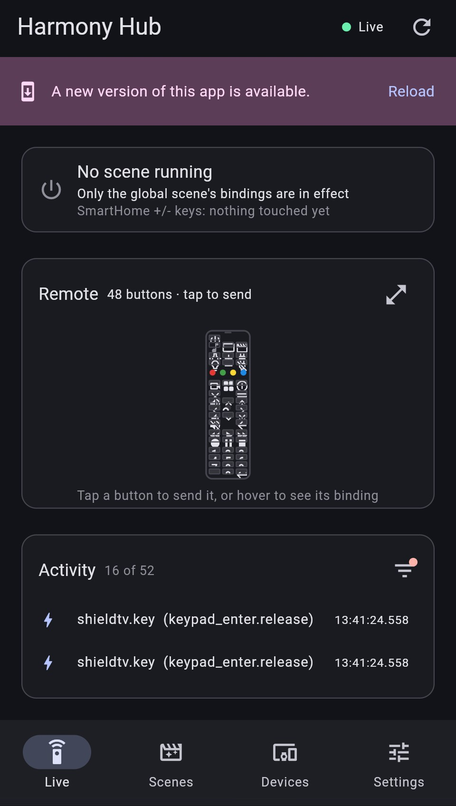
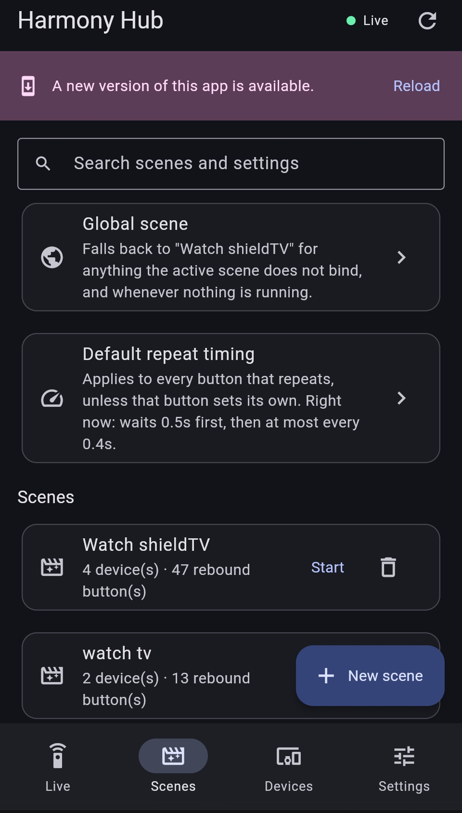
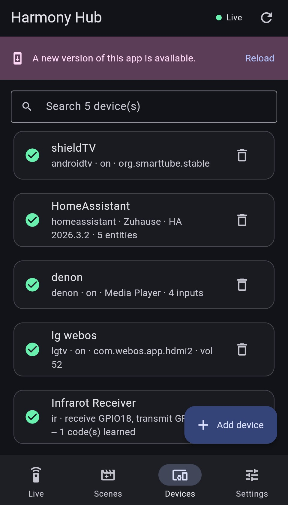
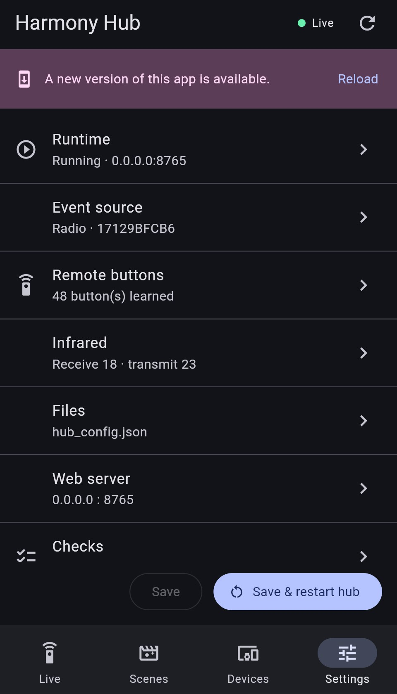

# Harmony Hub Replacement

Logitech Harmony Hub got discontinued, but your Harmony Companion remote still works fine — you just have nothing left to talk to it.
This project listens to your existing Harmony remote and lets you decide what every button does, all from a simple app on your phone or computer.

## What it can do

- **Turn a button press into anything you want** — "Power" can turn on your
  TV, your sound system, and switch to the right input, all at once.
- **Scenes** — a Scene is just "what I'm doing right now": Watch TV, Movie
  Night, Listen to Music. Starting one changes what every button on the
  remote means, so the same Volume button reaches the right device no matter what
- **A picture of your actual remote** — set things up by tapping buttons on
  a picture of the remote, not by memorizing button names.
- **Works from your phone or a browser** 

## App Screenshots








## Running it

The first time, set everything up:

```bash
python -m venv venv
venv\Scripts\activate
pip install -e .
cd app
flutter build web
cd ..
```

After that, starting it up is just one command:

```bash
harmony-hub
```

Then open **http://localhost:8765** in your browser — that's the app.
Leave the terminal window open in the background; closing it turns the
program off. Next time, you only need the `venv\Scripts\activate` and
`harmony-hub` lines — the setup step above is one-time only.

## Getting started

1. **Turn on the receiver.** This is the small piece of hardware that
   listens for your remote's signal.
2. **Point the app at your remote.** On the **Settings** tab, hit
   **Find my remote**. It asks how: with your old **Harmony Hub** still
   around, pairing takes a few seconds — press the pair/reset button on the
   Hub when asked. **No Hub at all?** Pick "I don't have a Hub" instead —
   it listens for your remote directly, no Hub involved, so keep pressing
   buttons on it for a minute or two until it locks on. Either way, Save
   afterward and the hub starts listening.
3. **Teach it your buttons.** Still on Settings, hit **Learn the remote**.
   Press each button on your Harmony remote once; it appears on screen,
   usually with the right name already filled in. Correct anything that
   looks wrong, then Save. You only do this once.
4. **Add your equipment.** On the **Devices** tab, add the TV, speaker, or
   box you want to control, and give each one a name. If you run **Home
   Assistant**, add it here too: give it the address, hit **Connect to Home
   Assistant** and paste in a token from your Home Assistant profile
   (Security → Long-lived access tokens → Create token), then **Choose
   entities** to pick the lights, switches and scenes worth putting on the
   remote. The six SmartHome keys at the bottom of the Harmony remote are
   waiting for exactly this, and get suggested for you.
   If you have a **Denon or Marantz receiver**, add it here too — just its
   address, no account and nothing to pair. First, on the receiver itself, set
   **Network → Network Control → Always On**, or it disappears from the network
   whenever it's switched off and nothing can wake it. Then hit **Choose
   entities** to tick the inputs you actually use, so the button lists aren't
   full of sockets with nothing plugged into them.
   If you have an **LG webOS TV**, add it with its address, then hit
   **Pair this TV** — a prompt appears on the TV itself; accept it with the
   TV's own remote, no code to type. First, on the TV, turn on
   **Settings → General → Devices → TV Management → Mobile TV On → Turn on
   via Wi-Fi** — that is what lets the remote wake the TV from standby;
   without it, every button works except power-on. Then **Choose entities**
   to pick the inputs and apps worth putting on the remote.
5. **Create scenes.** On the **Scenes** tab, make one for each thing you do
   — "Watch TV", "Movie Night", whatever makes sense to you.
6. **Map your remote.** For each scene, pick a device and tap through the
   picture of your remote to decide what each button should do. There are
   suggestions offered automatically — you can just accept them, or change
   anything you like.
7. **Start a scene**, pick up your Harmony remote, and try it.

That's the whole workflow. Find the remote, learn its buttons, add devices,
group them into scenes, map the buttons, done.

## The Settings tab

The Settings tab is where the program tells you what it's doing and lets
you fix things without needing a computer expert.

- If something isn't working, this tab will tell you why in plain language.
- You can **Start**, **Stop**, or **Restart** the program from here — no
  need to touch anything physical.
- There's a **"Find my remote"** button that automatically detects your
  remote's signal instead of you having to look anything up. It asks
  whether you still have a Harmony Hub to pair against (quick) or want to
  find the remote directly with no Hub at all (slower, but needs nothing
  but the remote itself).
- **"Learn the remote"** is where you teach it your buttons, or rename and
  remove ones you've already taught it.
- With a real remote or a replay hooked up, a **"Pause command execution"**
  switch lets you try that out — pressing buttons on real hardware, watching
  them show up live — without anything actually being sent to your TV,
  speaker, or lights. Handy for testing on the real thing without touching
  your equipment. The page makes it obvious when you're paused, so you
  won't forget it's on.
- A **"Run checks"** button double-checks that everything is set up
  correctly and tells you if anything's missing.

You never need to close the app to fix a problem — the page you're looking
at stays open the whole time, even while the program is restarting or
recovering from an issue.

## Good to know

- **Nothing breaks if you experiment.** Scenes and button mappings can be
  edited any time, even while nothing is running.
- **One remote, many devices.** You don't need a different remote for each
  gadget — that's the entire point.
- **It keeps a log.** The app shows a running feed of what just happened
  (which button was pressed, what it triggered), which is handy while
  you're still setting things up.
- **If a button fires too many times, adjust the repeat timing.** Buttons
  like Volume are meant to keep going while you hold them down, and a quick
  tap shouldn't. There's one setting for this that covers every button at
  once — on the **Scenes** tab, tap **Default repeat timing**. Raise **Wait
  before repeating** if a quick press does something several times, or
  lower it if holding the button feels sluggish to start. A second slider
  slows the repeats down once they start. If one particular button — a
  blind, a projector lens — needs different timing from all the others,
  open that button in a scene and turn on **Custom timing for this
  button** to set it individually without touching everything else.
- **The +/- keys always mean "the thing I just touched."** Toggle a light or
  a switch with one of the SmartHome keys, and +/- steps that same thing up
  or down — no need to bind them to one light in particular. The Live tab
  shows what they're currently pointed at, and if what you touched last
  can't be turned up or down (a switch, say), pressing + just says so.
- **Let the receiver own the volume.** If you've added an AV receiver, its
  suggestions claim the Volume and Mute keys, because that's the box actually
  turning the sound up. That's the same keys the Shield or TV would suggest, so
  whichever device you map last is the one those keys end up on — map the
  receiver last, and everything else where you want it.
- **Works on a phone screen too.** The layout adjusts automatically, so
  you're not stuck needing a full computer to make a change.

If in doubt, the **Settings** tab is always the place to look first.

Thanks to the following repo, this Project was able to be build:
https://github.com/joakimjalden/Harmoino